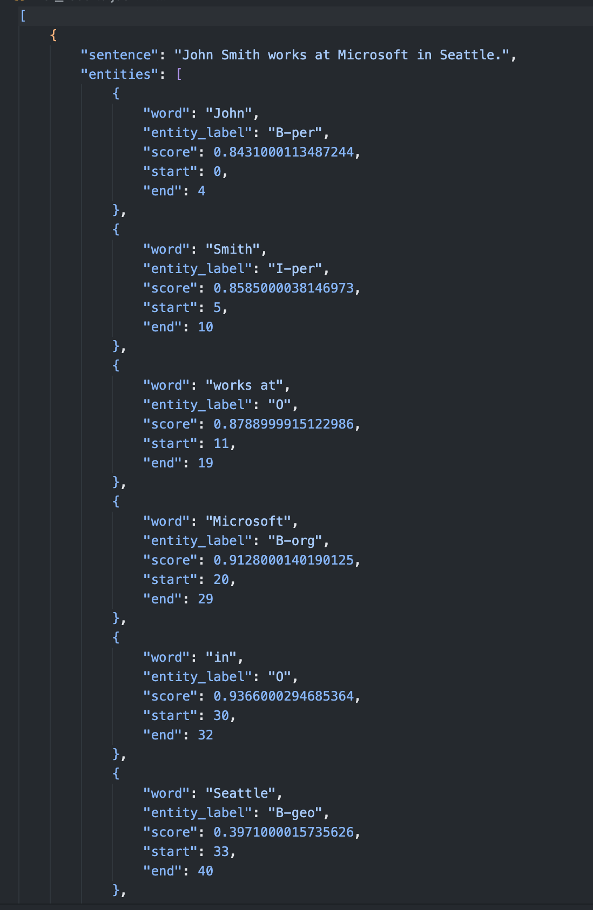

# BERT-based Named Entity Recognition (NER)

This repository contains the implementation of a Named Entity Recognition (NER) system based on a pre-trained BERT model (`dslim/bert-base-NER`). The project has two primary components:

1. **Dataset Creation and Annotation**
2. **Fine-Tuning of BERT Model**

## Project Overview

### 1. Dataset Creation and Annotation

#### Dataset 1
Annotated NER datasets were obtained from Kaggle:

- [Sentence Dataset](https://www.kaggle.com/datasets/vimlendusharma/name-entity-recognition-data)
- [Word Dataset](https://www.kaggle.com/datasets/debasisdotcom/name-entity-recognition-ner-dataset/data)


#### Dataset 2

Dataset 2 was created via web scraping and annotated using prompt engineering techniques with LLMs (e.g., Chat-GPT). The annotation was performed using the `chain of rule` prompting technique.

- **Source:** Business news articles scraped from the BBC website.
- **Data Size:** 15 articles, 706 sentences. The first 300 sentences were saved in a separate CSV file for prompt engineering tasks.
- **Annotation:** Annotated using Chat-GPT for NER tasks.

### 2. Fine-Tuning

The NER system is developed by fine-tuning the pre-trained BERT model (`dslim/bert-base-NER`) using the datasets created in the first part.

**Key Components:**
- **Training Script (`train.py`):**
  - Loads and preprocesses the datasets.
  - Converts text and entity tags into a BERT-compatible format.
  - Fine-tunes the pre-trained BERT model using Hugging Face's Trainer API.
  - Evaluates model performance using metrics such as precision, recall, and F1-score.

- **Pipeline Script (`pipeline.py`):**
  - Uses the fine-tuned model to perform entity recognition on new sentences provided in `input.txt`.
  - Outputs predictions, including detected entities and their positions, in a structured JSON format.

- **Shell Script (`run_script.sh`):** Automates the process by installing dependencies from `requirements.txt`, running `train.py` for model training, and executing `pipeline.py` for inference.

## Setup and Installation

### Prerequisites
- Python 3.8+
- Git
- Virtual Environment (Optional)

### Steps to Run
1. Clone the repository:
   ```bash
   git clone https://github.com/busrabektas/BERT-based-named-entity-recoginition
   cd BERT-based-named-entity-recoginition
   ```

3. You can simply run the system by this command:
   ```bash
   bash run_script.sh
   ```

## Results

- **Evaluation Metrics:**
  - Precision
  - Recall
  - F1-score

The fine-tuned model demonstrated significant improvements in identifying named entities in both Dataset 1 and Dataset 2. Specific results can be found in the output logs.

* An output example from ner_results.json:

